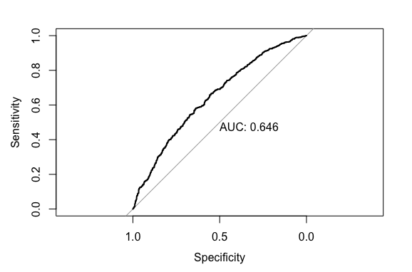

---
output:
  html_document: default
  pdf_document: default
---
# Bayesian Inference
### Xiao Wei
bayesian regression modeling utilizing Gibbs Sampling

## Abstract/Executive Summary
The purpose of this analysis is to determine if certain store groups within two different merchant channels have different risk profiles that is not accounted for within the main risk decisioning model. If there exists statisticaly significant effects between store groups that would mean that the risk model is not accurately capturing the different risk profile of store groups and that the model should be updated.

Using a mixed intercepts model with uninformative priors, this study found that there is no statistically significant effect of the two binary store group `special_1` and `special_2` variables at the 0.05 significance level. Hence the main risk model does accurately take into account different risk profiles of customers in each respective store group/merchant.

## Data
The data consists of 8873 observations and five variables pulled from a proprietary source. It contains lease defaults as the binary dependent variable while underwriting merchant of origin, underwriting risk model score, special store group 1, and special store group 2 as independent variables. Below are some tables and summary statistics. Aside from the `score` field, the `merchant_1` and `special_#` fields are binary. The data was pulled from a SQL database in Python and exported into a csv file to be read by R. There are no missing fields or values.

```
head(df)
       score merchant_1 special_1 special_2 y
1 0.18450688          1         0         0 1
2 0.18450688          1         0         0 1
3 0.01517081          1         0         0 0
4 0.06607112          1         0         0 0
5 0.07223662          1         1         0 0
6 0.19193593          1         0         0 0
```
```
summary(df$score)
     Min.   1st Qu.    Median      Mean   3rd Qu.      Max. 
0.0009206 0.0474175 0.0957779 0.0995584 0.1416601 0.3862006 

table(df$merchant_1, df$special_1)
       0    1
  0  829    0
  1 7083  961
  
table(df$merchant_1, df$special_2)
       0    1
  0   61  768
  1 8041    3
```
The dependent variable is binary with a mean of around `.074`

## Model
Three bayesian logistic regression models were tested. Logistic regression is used since the response is  binary.

The first model uses the data as provided with `score` as a continuous variable along with `merchant_1` and the two `special_#` variables as binary variables, finally a intercept was also added.

```
  logit(p[i]) = b0 + b[1]*score[i] + b[2]*merchant_1[i] + b[3]*special_1[i] + b[4]*special_2[i]
```

The second model is a mixed intercept model similar to the first model except with a different intercept at the merchant level (for a total of two intercepts).

```
  logit(p[i]) = a[merchant[i]] + b[1]*score[i] + b[2]*special_1[i] + b[3]*special_2[i]
```

The third model is a mixed effects model with `merchant` as the fixed effect and `special_#` as the random effect.

```
  logit(p[i]) = b0 + b[1]*score[i] + b[2]*merchant_1[i] + r[st[i]]
```

All priors for coefficients are non informative priors of `b ~ norm(0, 1/100)` including the intercept(s). This is done because the modeler didn't have any prior biases before modeling started.

All three models use `score` to control for the fact that customers of different stores/merchants have different levels of risk behavior. The goal of the model is to see the statistical significance and impact of the `special_1` and `special_2` stores.

Looking at the effective sample size of the three models for the two `special` variables, the mixed intercepts model has the highest effective sample size for the `special_2` variable.

```
> mod_base_dict$effective_size
      b[1]       b[2]       b[3]       b[4]         b0 
1023.67600   56.70015 7597.70976  111.74161   54.61580 

> mixed_int_dict$effective_size
     a[1]      a[2]      b[1]      b[2]      b[3] 
 637.3183  963.7044  885.8516 7350.8854  807.9928
 
> hier_dict$effective_size
      b[1]       b[2]         b0       r[1]       r[2]       r[3]       r[4] 
1042.99174   65.92866   66.08206  458.77198  115.30070   92.34065  132.57368 
 
 where r[1-4] are random effects for store group / merchant combinations
```
After looking through traceplots and the sample sizes table above, it was determined that all variables in the mixed intercept model have converged while not all variables converged in the other two models.

Discriminative power is very important for credit risk models so I will plot the show the area under curve for the mixed intercepts model.

```
logit <- function(x){
  return (1/ (1 + exp(-x)))
}
mixed_coefs <- colMeans(mixed_int_dict$csim)
y_pred_1 <- logit(mixed_coefs["a[1]"] + 
                    as.matrix(df_int[df_int$merchant == 1, c(1, 3,4)]) %*% mixed_coefs[c(3,4,5)])
y_pred_2 <- logit(mixed_coefs["a[2]"] + 
                    as.matrix(df_int[df_int$merchant == 2, c(1, 3,4)]) %*% mixed_coefs[c(3,4,5)])
y_preds <- c(y_pred_1, y_pred_2)
y <- c(df_int[df_int$merchant == 1, 5], df_int[df_int$merchant == 2, 5])
library(pROC)
plot.roc(y, y_preds, print.auc=TRUE)
```
I am satisfied that the AUC score is similar to previous studies


## Results

Using a burn in of 5,000 was needed to get autocorrelation of `intercept`, `merchant_1`, and `special_group_2` variables to be reliable in the mixed intercept model that was chosen.

All three models have around the same mean deviance. The mixed intercepts model has the lowest penalty and the lowest autocorrelation for the estimated coefficients.

```
base model DIC
Mean deviance:  4518 
penalty 4.736 
Penalized deviance: 4523 

Mixed Intercept DIC
Mean deviance:  4518 
penalty 4.384 
Penalized deviance: 4522 

Hierachical Mixed Effects DIC
Mean deviance:  4519 
penalty 4.838 
Penalized deviance: 4524 
```

Here is the model string again along the mean estimates of mcmc.

```
  logit(p[i]) = a[merchant[i]] + b[1]*score[i] + b[2]*special_1[i] + b[3]*special_2[i]

       a[1]        a[2]        b[1]        b[2]        b[3] 
-3.40079692 -3.43909949  8.38304580  0.04073111 -0.50201253 

```

The variables of interest are the `special_1` and `special_2` dummy variables. 

Below are the proportion of posterior estimates that are opposite the sign of the mean of the respective estimates

```
> mean(mixed_int_dict$csim[,5] > 0) 
[1] 0.05686667

> mean(mixed_int_dict$csim[,4] < 0) 
[1] 0.3806
```
Given these p-values are greater than 0.05 even without accounting for multiple tests, this study has failed to reject the null hypothesis. Failing to reject the null hypothesis means that stores in `special_1` and `special_2` groups do not statistically differ from stores not in these respective groups.
One caveat to this study is that `special_2` store group make up 92% of observations that are not part of merchant_1. This lead to some multicollinearity with the intercept and merchant_1 variable. Hence why the mixed intercept model was chosen instead of the other two models.

